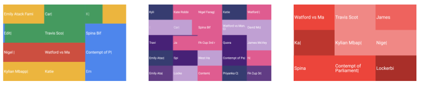

# Griddy

An example of using the [Sheets API](https://developers.google.com/sheets/api/) to power a grid-based text visualisation



## Overview

Griddy provides [Google Trends Screensaver-esque](https://www.google.com/trends/hottrends/visualize?nrow=3&ncol=4) visualisation of words and phrases, powered by the Sheets API.
Perfect for that wallmounted screen in the office!

You can try this out at [griddysheets.firebaseapp.com](https://griddysheets.firebaseapp.com)

Once authorized, select a Google Sheet to load data from. Words will be taken from the first column of each and every sheet in the Sheets file.

In this solution, Sheets is used as a convenient aggregation point: Different processes or accounts can populate different sheets within the same file, and all be visualized. Easily accessible via the API, and from Apps Script, including from Google Ads, it therefore allows easy visualisation of reporting data, such as search queries, keywords, or trends obtained from other APIs.


## Deployment

1.  Create a new Google Cloud project

1.  Enable the following APIs

    *   Sheets API
    *   Drive API
    *   Picker API

1.  Within the new Cloud project, create new credentials, under **APIs & Services**:

    *   Click on **OAuth consent screen**
        *   Add *Application name*, *support email*.
        *   Add `https://www.googleapis.com/auth/drive.file` to *Scopes for Google APIs*
        *   Add any domains you are hosting on to *Authorized domains*, for example if using Firebase hosting: `https://projectname.firebaseapp.com`
        *   Click **Save**.
    *   Click **Create credentials** and create a new *API key*.
    *   From the same dropdown, create also a new *OAuth client ID*.
        *   Add `http://localhost:8080 ` as a *Authorized JavaScript origins* and *Authorized redirect URIs*.
        *   Add also any hosts where you plan to deploy this application, again for example if using Firebase hosting: `https://projectname.firebaseapp.com`

1.  In order to build the solution, set the following environment variables:

    *   `GRIDDY_CLIENT_ID` - The *OAuth client ID* from the above step.
    *   `GRIDDY_API_KEY` - The *API key* from the above step.
    *   (optional) `GRIDDY_GA_ID` - A Google Analytics ID if you wish to use GA.

    This can most easily be done in a script, e.g. `creds.sh` which is already included in the `.gitignore`

    ```shell
    export GRIDDY_CLIENT_ID=xxxxxxxx.apps.googleusercontent.com
    export GRIDDY_API_KEY=Axxxxxxxxxxxxxxxxxxxxxxxx
    export GRIDDY_GA_ID=UA-xxxxxxxxxxx-1
    ```

    Then running: `source creds.sh`

1.  To build, the  run:

    ```shell
    npm install
    npm run build
    ```

    The application will be built to the `dist/` folder.

1.  Alternatively, to run locally execute:


    ```
    ./node_modules/.bin/webpack-dev-server
    ```

## Ads example: Search query report

The [following samples](ads/) demonstrate populating the Sheet for visualisation using [Google Ads Scripts](https://developers.google.com/google-ads/scripts/).

## Errors in the console

Some errors may appear in the console:

*   `Failed to execute 'postMessage' on 'DOMWindow'...` and `Invalid 'X-Frame-Options' header encountered ... `: These are [long-standing issues](https://groups.google.com/forum/#!msg/google-picker-api/_wF1O_3j7ZE/yfHhQTz2DPwJ) with the [Picker API](https://developers.google.com/picker/) and do not affect the functionality of the application.

*   `GET https://lh3.googleusercontent.com/d/....` returns `403` error: The application uses the [`drive.file`](https://developers.google.com/drive/api/v2/about-auth#what_scope_or_scopes_does_my_app_need)
    scope, which limits access to only files that have been opened by the application. These 403 errors result from the Picker trying to show thumbnails in the dialog for other documents which have
    not been opened by the application, therefore no access is granted.